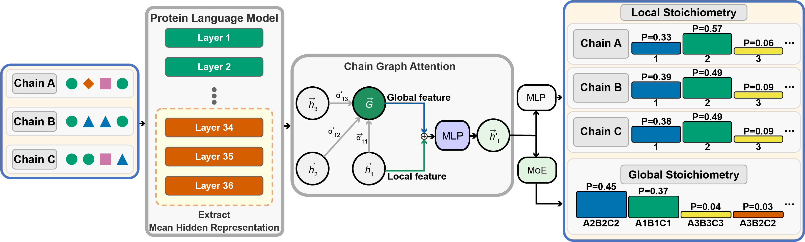

# StoPred

[](LICENSE)
[](https://www.biorxiv.org/content/10.1101/2025.10.20.683515v1)
[](https://seq2fun.dcmb.med.umich.edu/StoPred/)
[](https://codeocean.com/capsule/7746930/tree)

StoPred predicts the stoichiometry of protein complexes from sequence or structure features. It combines pretrained protein language model embeddings with a chain graph attention network, then integrates local chain-level copy-number predictions with global stoichiometry predictions.



## Links

- Web server: https://seq2fun.dcmb.med.umich.edu/StoPred/
- Preprint: https://www.biorxiv.org/content/10.1101/2025.10.20.683515v1
- CodeOcean capsule: https://codeocean.com/capsule/7746930/tree
- Release notes: [RELEASE_NOTES.md](RELEASE_NOTES.md)
- Pretrained checkpoints and prepared container: available from the StoPred web server download section

## Requirements

- Linux operating system.
- Python 3.11.
- CUDA-capable GPU for training and routine inference. CPU execution is supported for lightweight checks but is significantly slower.
- `rsync` for downloading the PDB mmCIF archive.
- `curl` or `wget` for downloading the ESM-C 600M weight file.
- Access to the wwPDB mmCIF archive for rebuilding the training dataset.
- Pretrained StoPred checkpoints for local inference unless training a model from scratch.
- ESM-C 600M weights at `external/esmc_600m_2024_12_v0.pth`.

## Installation

StoPred is tested on Linux with Python 3.11 and CUDA-capable GPUs. CPU execution is possible for small checks but is not recommended for training or large inference runs.

Using `uv`:

```bash
uv sync
source .venv/bin/activate
```

Using Conda and pip:

```bash
conda create -n stopred python=3.11
conda activate stopred
pip install -r requirements.txt
```

Download the ESM-C 600M weight file:

```bash
bash external/download_esmc_600m.sh
```

By default this writes:

```text
external/esmc_600m_2024_12_v0.pth
```

Set `HF_TOKEN` if your Hugging Face access requires authentication. The script supports resumable downloads through `curl` or `wget`.

Downloader options:

- `-o, --output`: write the weight file to a non-default path.
- `--force`: re-download even if the output file already exists.
- `HF_TOKEN`: optional environment variable used for authenticated Hugging Face downloads.

The pretrained StoPred model checkpoints and prepared container are distributed from the StoPred web server. For local inference, pass the downloaded checkpoint directory with `--model_dir`.

## Typical Installation Time

Using the CodeOcean capsule or the prepared container from the StoPred web server, setup should take less than 1 minute because the environment is already configured.

For local installation with `uv` on a Linux workstation with CUDA-compatible drivers, dependency setup is typically about 1 minute when packages are cached. A fresh installation may take longer depending on network speed. Downloading the ESM-C 600M weight file is a separate step and depends on network bandwidth.

## Predict

Create one FASTA file per target in an input directory:

```text
input_fasta/
  Target001.fasta
  Target002.fasta
```

Each FASTA header should identify one input chain. Headers for the same target are read from the same FASTA file.

Run prediction:

```bash
python stopred_prediction.py \
    input_fasta \
    output_predictions \
    --topk 10 \
    --alpha 0.5 \
    -unk \
    --device cuda
```

Key arguments:

- `input_fasta`: directory containing one FASTA file per target.
- `output_predictions`: directory where StoPred writes one JSON file per target.
- `--train-release-date`: optional training cutoff used to pin release-specific model directories. Use `YYYYMMDD` or `YYYY-MM-DD`. If omitted, StoPred uses the latest available release-tagged model for each required model role.
- `-unk`: for single-entry FASTA targets, use the unknown-single model to distinguish monomer from homomer. Targets with more than one FASTA entry always use the default release model.
- `--model-root`: root directory containing model folders. By default this is `Config.inference.model_root`.
- `--model_dir`: optional override for the default/heteromer model directory.
- `--unk_model_dir`: optional override for the unknown-single model directory used with `-unk`.
- `--topk`: number of final stoichiometry predictions to report per target.
- `--alpha`: local/global score mixing weight used when ranking stoichiometry assignments. Larger values give more influence to the global stoichiometry head for heteromeric cases.
- `--device`: compute device, usually `cuda` or `cpu`.

By default, StoPred scans release-tagged model folders such as `models_collection/default_YYYYMMDD` and selects the newest available release. With `-unk`, single-entry FASTA targets use `models_collection/unk_single_YYYYMMDD`, while multi-entry FASTA targets use `models_collection/default_YYYYMMDD`. If an input folder needs both model types, StoPred chooses the newest release date that has both folders. The model root and release-name prefixes are configured in `Config.inference`. A single-entry FASTA file means one submitted sequence for that target; multi-entry FASTA targets are treated as complex inputs and use the default model.

The JSON output contains:

- `chain_level_predictions`: copy-number probabilities for each input chain.
- `global_predictions`: global stoichiometry probabilities aggregated across folds.
- `topk_predictions`: the final ranked stoichiometry assignments and scores.
- `model_selection`: release date, model role, and model directory used for that target.

The included CASP example can be used as a sanity check:

```bash
python stopred_prediction.py \
    casp_example/input_fasta \
    casp_example/output_dir_pred \
    --model_dir models_collection/default \
    --topk 10 \
    --alpha 0.5 \
    --device cuda
```

Expected demo runtime: the included CASP example should finish in less than 1 minute on a CUDA-capable GPU after the StoPred checkpoints and ESM-C weights are available. The output JSON files should match the structure shown in `casp_example/output_dir`.

## Data Preparation

Download the PDB mmCIF archive and obsolete records:

```bash
bash external/download_pdb_mmcif.sh /path/to/pdb_cache
```

`/path/to/pdb_cache` is the local cache root. The script creates the `pdb_mmcif/` subdirectory under this path and downloads the `divided/` and `obsolete/` wwPDB layouts. Set `PDB_RSYNC_ROOT` to use a different wwPDB rsync mirror.

The downloader keeps the native wwPDB rsync layout and leaves files compressed:

```text
/path/to/pdb_cache/pdb_mmcif/divided/
/path/to/pdb_cache/pdb_mmcif/obsolete/
```

Parse the cached archive into StoPred JSON:

```bash
python parse_PDBmmcif_gz.py /path/to/pdb_cache/pdb_mmcif \
    --exclude_obsolete \
    --checkpoint_interval 8000 \
    -n 24 \
    -o raw_data/PDBmmcif.json
```

Key arguments:

- `/path/to/pdb_cache/pdb_mmcif`: root directory containing the wwPDB `divided/` directory and optionally `obsolete/`.
- `--exclude_obsolete`: skip obsolete PDB entries when building the parsed JSON.
- `--checkpoint_interval 8000`: save partial progress every 8000 completed PDB IDs, which makes long parses resumable.
- `-n 24`: use 24 CPU worker processes. Adjust this to match the available CPU cores and I/O bandwidth.
- `-o raw_data/PDBmmcif.json`: output JSON path consumed by `prepare_data.py`.

The parser supports `divided/`, `obsolete/`, `.cif.gz`, and `.cif` inputs. It writes a metadata sidecar and can reuse previously parsed PDB IDs unless `--force_full_parse` is set.

Build the default dataset and label maps:

```bash
python prepare_data.py
```

This writes:

- `Dataset/StoPredDataset.pkl`
- `Dataset/all_sequences.fasta`
- `Dataset/count2label.json`
- `Dataset/label2idx.json`
- `Dataset/sto2idx.json`

Generate or update ESM-C sequence embeddings:

```bash
mkdir -p Dataset/features
python utils/ESMC_SequenceFeatureExtraction_multigpu.py \
    Dataset/all_sequences.fasta \
    Dataset/features/sequenceFeatures.pkl \
    -cuda 0
```

Use `-cuda -1` for CPU or a comma-separated GPU list such as `-cuda 0,1` for distributed extraction. Add `--update` when appending features to an existing pickle.

## Train

Train the default cross-validation model:

```bash
python train_sto_net.py \
    --features sequence \
    --data Dataset/StoPredDataset.pkl \
    --output_dir runs/stopred_default \
    --device cuda
```

Key arguments:

- `--features`: feature types used by the model. `sequence` uses ESM-C embeddings; `structure` uses precomputed structure features.
- `--data`: dataset pickle built by `prepare_data.py`.
- `--output_dir`: directory for fold checkpoints and training reports.
- `--device`: training device.

Optional loss controls:

- `--local-class-weighting {none,inverse,inverse_sqrt}`: copy-count class reweighting for local chain-level predictions.
- `--local-loss {ce,focal}`: local copy-count loss function.
- `--local-soft-f1-weight FLOAT`: optional soft-F1 loss weight for local copy-count classification.

The trained directory contains one checkpoint per fold, named `model_fold{k}.pkl`.

## Unknown Single-Sequence Model

The default StoPred model assumes the user already knows that every submitted sequence is a complex subunit. For a single sequence where the biological state may be monomer or homomer, train a separate monomer-aware model.

Unknown-single defaults are configured in `Config.unknown_single_sequence`. The dataset and model name are concise and cutoff-aware:

```text
unk_single_<Config.data.cut_off_date as YYYYMMDD>
```

Prepare the monomer-aware dataset:

```bash
python prepare_unknown_single_sequence_data.py
```

By default this writes `Dataset/unk_single_YYYYMMDD/` with:

- `dataset.pkl`
- `count2label.json`
- `label2idx.json`
- `sto2idx.json`
- `all_sequences.fasta`
- `summary.json`

Update embeddings for the added monomer sequences:

```bash
python utils/ESMC_SequenceFeatureExtraction_multigpu.py \
    Dataset/unk_single_YYYYMMDD/all_sequences.fasta \
    Dataset/features/sequenceFeatures.pkl \
    -cuda 0 --update
```

`--update` keeps existing embeddings in `Dataset/features/sequenceFeatures.pkl` and extracts only sequences that are not already present.

Train the unknown-single model:

```bash
python train_unknown_single_sequence.py --device cuda
```

The wrapper reads its dataset path, map path, output model directory, and loss defaults from `config.py`. The current default local objective is weighted cross entropy with `inverse_sqrt` class weights capped at `5.0`.

## Evaluate

Evaluate any split from a dataset pickle:

```bash
python evaluate_stopred.py \
    --model_path runs/stopred_default \
    --dataset-pkl Dataset/StoPredDataset.pkl \
    --split test_data \
    --target-scope non_monomer \
    --top-n 10 \
    -o runs/stopred_default_eval/test_data
```

Key arguments:

- `--model_path`: model checkpoint file or directory containing fold checkpoints.
- `--dataset-pkl`: dataset pickle containing the requested split.
- `--split`: split key inside the dataset pickle, such as `test_data`.
- `--target-scope`: target subset to evaluate. Use `non_monomer` for the default multimer model and `single_entity` for monomer/homomer evaluation.
- `--top-n`: largest N used for top-N accuracy reporting.
- `--alpha`: optional local/global score mixing weight; defaults to `Config.inference.alpha`.
- `-o`: output directory for evaluation tables and prediction pickles.

For the unknown-single model:

```bash
python evaluate_stopred.py \
    --model_path models_collection/unk_single_YYYYMMDD \
    --dataset-pkl Dataset/unk_single_YYYYMMDD/dataset.pkl \
    --split test_data \
    --target-scope single_entity \
    --top-n 10 \
    -o models_collection/unk_single_YYYYMMDD_eval/test_data
```

Use `--split monomer_test_data --target-scope single_entity` to report monomer accuracy separately.

Evaluation outputs include:

- `topn_accuracy.csv`
- `classification_report.csv`
- `per_target_predictions.csv`
- `mean_predictions.pkl`
- `all_fold_results.pkl`

## Repository Layout

- `config.py`: central paths, cutoffs, model hyperparameters, and inference settings.
- `prepare_data.py`: default dataset curation from processed mmCIF JSON.
- `parse_PDBmmcif_gz.py`: cached parser for compressed or uncompressed mmCIF archives.
- `prepare_unknown_single_sequence_data.py`: monomer-aware dataset builder.
- `train_sto_net.py`: default StoPredNet training.
- `train_unknown_single_sequence.py`: unknown-single monomer-aware training wrapper.
- `evaluate_stopred.py`: top-N accuracy and per-class evaluation.
- `stopred_prediction.py`: FASTA-directory inference CLI.
- `network/`: StoPredNet model and dataset utilities.
- `utils/`: feature extraction, parsers, and alignment helpers.
- `external/`: PDB and ESM-C download helpers plus local pretrained assets.
- `casp_example/`: small inference example.

## Citation

```bibtex
@article{liu2025stopred,
  title = {StoPred: Accurate Prediction of Protein Complex Stoichiometry Using Deep Learning},
  author = {Liu, Quancheng and Peng, Chunxiang and Zheng, Wei and Zhang, Chengxin and Freddolino, Lydia},
  journal = {bioRxiv},
  year = {2025},
  doi = {10.1101/2025.10.20.683515},
  url = {https://www.biorxiv.org/content/10.1101/2025.10.20.683515v1}
}
```

## License

StoPred is released under the MIT License. See [LICENSE](LICENSE).
